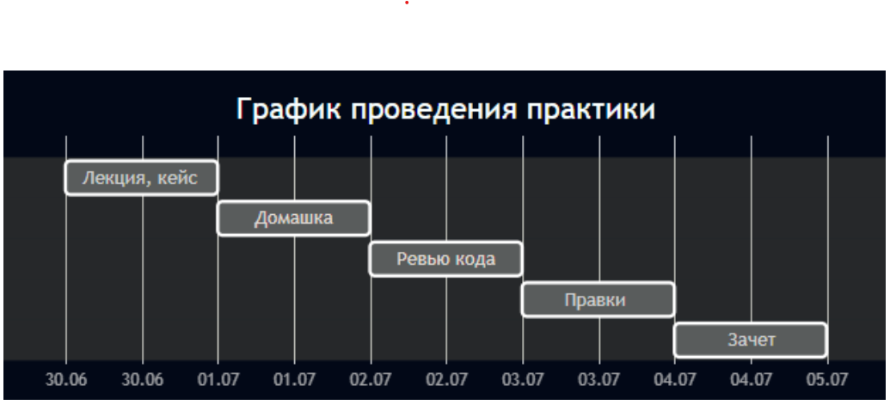

# scbt-summer-practice-2025
Репозиторий с кодом студентов летней практики СКБТ 2025

Содержание:
- [Кейс](#кейс)
- [Сроки](#сроки)
- [Как работать с репозиторием](#как-работать-с-репозиторием)
- [Контакты для связи](#контакты-для-связи)

## Кейс
### Описание кейса
Требуется реализовать систему для конвертации валют и отображения списка курсов валют. В упрощенном варианте пользователь может просматривать курсы валют, конвертировать валюту на указанную сумму в другую. В более сложном варианте, пользователь может выбрать пункт обмена по карте и просмотреть курсы в нем.
### Функциональные требования
- требуется реализовать интеграцию для получения актуальных курсов валют
- курсы валют должны обновляться раз в час
- фронтенд и бекенд части должны быть связаны по протоколу HTTP (целевая версия – 1.1, использование других не возбраняется)
- фронтенд должен быть адаптивен для мобильных устройств
- фронтенд может быть в дальнейшем встроен в существующие веб-сайт/приложения
- помимо текущего курса валюты, требуется отображать график с изменением цены за последние 1д/1н/1м/6м/1г
- для бекенда требуется предоставить swagger-документацию по endpoint-ам для фронтенда
### Тех стек кейса
Angular для фронта, C# для бекенда, PostgreSQL в качестве БД.
## Сроки

## Как работать с репозиторием
1. Регистрируемся на платформе gitflick.
2. Делаем форк этого репозитория к себе.
3. Создаем папку со своими инициалами, например proninaa (если у нескольких людей инициалы в приведенном формате совпадают, добавьте несколько букв в имени/отчестве для идентификации).
4. Пилим совй код в своей папке.
5. Открываем мр на вливание своих изменений в эту репу.
6. Ждем комментарии, правим.
7. Работа считается принятой, как только мр закрывается и код вливается в основнйо репозиторий.
## Контакты для связи
- Антон: proninaa1@sovcombank.ru
- Денис: utyuganovda@sovcombank.ru